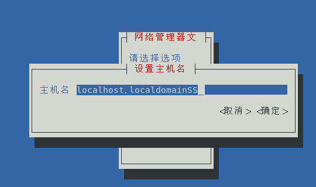
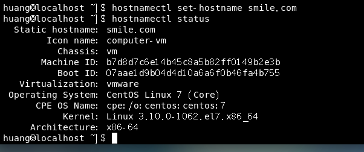
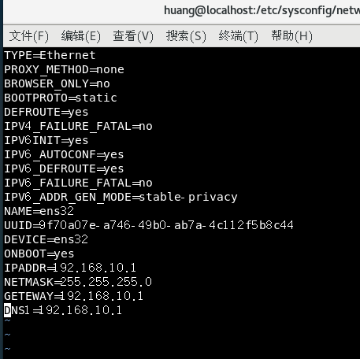
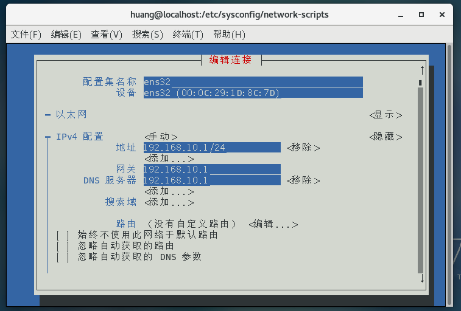

# Linux网络服务

## 配置网络服务

```
linux主机要与网络中其他主机进行通信，首先要进行网络配置
```

网络配置通常包括：

##### 主机名：

```
/etc/hostname
```

​	**使用nmtui命令修改主机名：**

​	使用nmtui修改主机名后需要重启hostnamed服务

```
systemctl restart systemd-hostnamed
```

​	**使用hostnamectl修改主机名**

```
hostnamectl set-hostname 主机名
查看主机名：
	hostnamectl status
```



​	**使用nmcli修改主机名**

```
查看主机名：
	nmcli general hostname
修改主机名：
	nmcli general hostname 主机名
重启hostnamed服务让hostnamectl知道静态主机名被修改
	systemctl restart systemd-hostnamed
```

##### IP地址

​	**网卡的配置文件**

```
这个目录存放网卡的配置文件
	/etc/sysconfig/network-script
```

​	**修改网卡配置文件**



​	**重启network服务**

```
使用配置文件进行网络配置，需要重启network服务
	systemctl restart network
```

​	**使用（nmtui）图形界面配置网络**



​	**使用nmcli命令配置网络**

```
显示所有连接：nmcli connection show
nmcli connection show --active
nmcli connection show "ens32"
显示设备状态：nmcli device status
nmcli device show ens32
重新截止配置：nmcli connection reload
nmcli connection dowm test2：禁用test2配置，一个网卡可以有多个配置
nmcli connnection up test2
nmcli device disconnct ens32:禁用ens32网卡
nmcli device connect ens32
```


子网掩码
默认网关
DNS服务器

## ssh服务

