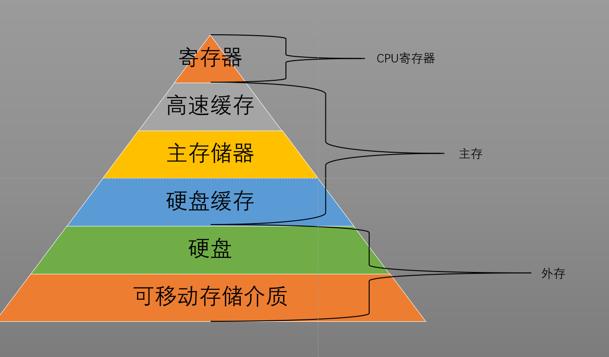
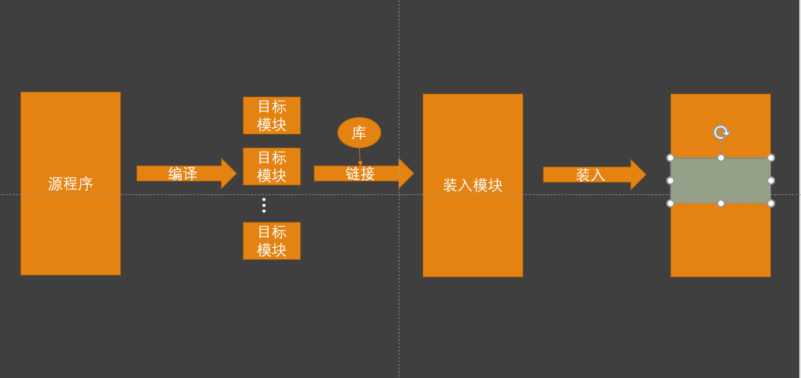
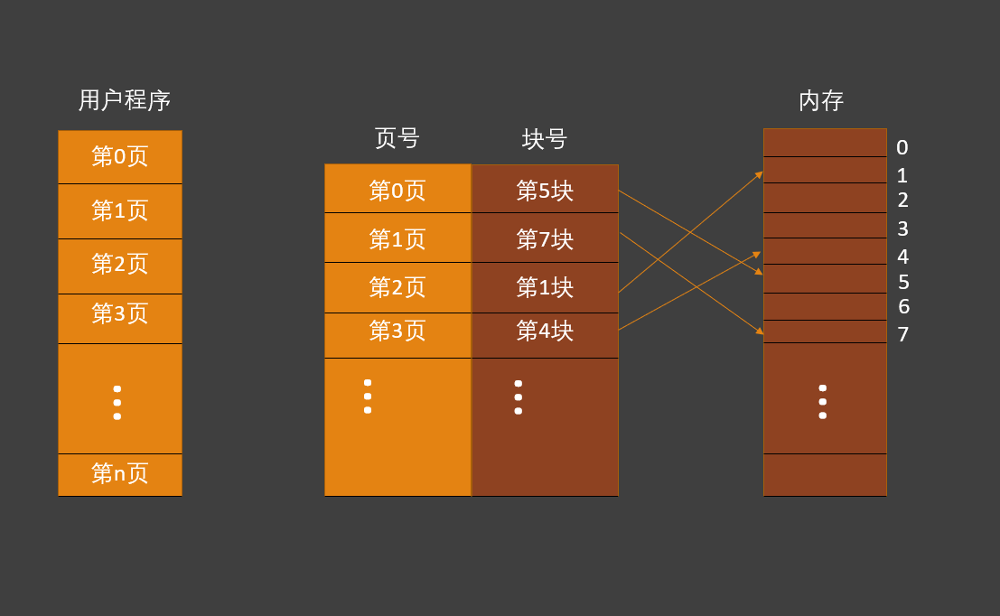

### 存储器管理

#### 一、存储器的层次结构

> 存储器多层结构

​	对于通用计算机而言，存储层次至少有三级：CPU寄存器——内存——外存

​	更详细的分层可以为 

> 可执行存储器

​	寄存器和主存又被称为可执行存储器，进程能够使用load和store指令对寄存器和主存进行访问，而对于外存，则需要进行I/O

> 主存

​	主存用于保存进程运行期间的程序和数据，CPU从主存中取得指令和数据，并将所取得的指令和数据加载到CPU寄存器中（指令寄存器和数据寄存器）。

​	但CPU执行指令的速度远高于从主存中读取指令的速度，故引入了寄存器和高速缓存。

> 高速缓存

​	高速缓存是介于寄存器和主存之间的存储器，主要用于备份主存中常用的数据，以降低CPU访问主存的频率。

> 寄存器

​	寄存器具有和CPU相同的速度，能够和CPU快速协作

> 硬盘缓存

​	硬盘缓存是为了缓和I/O读取速度慢的缺陷，当硬盘缓存和高速缓存不同，它本身并不是一种实际存在的存储器，而是利用内存中的部分存储空间暂时存储从硬盘读取或写入的数据。

#### 二、程序的转入和链接

​	程序要在操作系统上运行，必须先将它加载到内存，再将其转变为一个可以被执行的程序，通常需要经过编译、链接、装入三个步骤。

> 编译：由编译程序对源程序进行编译，形成若干个目标模块
>
> 链接：由链接程序将编译形成的一组目标模块以及它们所需要的库函数链接在一起，形成一个装入模块
>
> 装入：由装入程序将转入模块加载到内存

>  程序的转入

* 绝对装入方式：逻辑地址与物理地址相同。
* 可重定位装入方式：在程序装入时对程序中的指令和数据地址进行修改（即重定位），因为地址变换是在程序装入时一次性完成的，以后不可在改变，故又称为静态重定位。
* 动态运行时装入方式：程序装入内存后并不立即把逻辑地址转换为物理地址，而延迟到程序运行时才进行地址变换，需要重定位寄存器的支持。

> 程序的链接

* 静态链接：链接后再装入
* 装入时动态链接：边链接边装入
* 运行时动态链接：程序运行时再链接（加快程序的装入过程，节省内存空间）

#### 三、连续分配存储器管理方式

​	为了能将程序装入内存，必须为程序分配一定大小的内存空间，连续分配方式就是将程序的逻辑地址在装入内存后的物理地址也是有序的，连续分配方式可划分为四类：单一连续分配、固定分区分配、动态分区分配和动态可重定位分区分配

> 单一连续分配

​	单道程序环境中把内存分为系统区和用户区，系统区仅提供给操作系统使用，而用户区仅能装有一道用户程序

> 固定分区分配 

​	为使内存中可同时存放多道用户程序，将用户区内存空间划分为若干固定不变大小的区域

* 划分分区的方式
  * 分区大小相等
  * 分区大小不等
* 内存分配
  * 将内存分区按其大小进行排队，并建立一张分区使用表，用来记录哪些分区已被使用及空闲分区

> 动态分区分配

​	动态分区分配又称为可变分区分配，能够根据进程的实际需要，动态地为之分配内存空间

* 动态分区数据结构
  * 空闲分区表
  * 空闲分区链
* 动态分区分配算法
  * 首次适应（FF）
  * 循环首次适应（NF）
  * 最佳适应（BF）
  * 最坏适应（WF）
  * 快速适应
  * 伙伴系统
  * 哈希算法
* 分区分配操作
  * 分配内存
  * 回收内存

> 动态可重定位分区分配

* 紧凑：通过移动内存中的程序的位置，使得原来多个分散的小分区拼接成一个大分区的方法。在每次“紧凑”后都需要对移动的程序或数据进行重定位。
* 动态重定位

#### 四、对换（Swapping）

​	“对换”是指把内存中暂时不能运行的进程或暂时不需要的程序和数据换出到外存，以便腾出足够的内存空间，再把已具备运行条件的进程或进程所需要的程序或数据换入内存

​	CPU的中级调度（内存调度）其实就是存储器的对换功能，目的是用来内存紧张问题

> 对换进程：负责把进程换进换出内外存中
>
> 对换的类型

* 整体对换：以整个进程为单位进行对换
* 分段对换：以进程的一个分段为单位进行对换，使用到请求分页和请求分段存储管理技术

<u>为实现进程对换，系统必须能实现三方面的功能：对对换空间的管理、进程的换出和进程的换入</u> 

> 对换空间

​	在具有对换功能的OS中，通常把磁盘空间分为文件区和对换区两部分。

* 文件区：文件区内存放不常用的文件，访问频率低，故对文件区管理的主要目标是提高文件出去空间的利用率，采用离散分配
* 对换区：对换区只占磁盘空间的小部分，存放经常需要换进内存的进程，访问频率高，对对换空间管理的主要目标识提高进程换入换出的速度，采用连续分配
  * 对换区数据结构
    * 空闲分区表
    * 空闲分区链

> 进程的换入与换出

​	当内核执行某操作发现内存不足时，会调用对换进程，实现进程的换出和换入。

* 进程的换出：对换进程实现进程换出时，是将内存中的某些进程调换至对换区，以腾出内存空间，分两步
  * 选择被换出的进程：首先选择阻塞的进程，若无阻塞进程则选择优先级低的进程
  * 进程换出过程：在对进程换出时，只能换出非共享的程序和数据
* 进程的换入：对换进程定时执行换入操作，首先查看PCB集合中所有进程的状态，从中找出“就绪”状态但已换出的进程，并选择其中已换出到磁盘时间最久的进程换入内存

#### 五、离散分配存储管理方式

​	能够将一个进程直接分散分配到许多不相邻的分区中，这样能够充分利用内存空间，无需进行“紧凑”

> 分页存储

​	将用户程序地址空间分为若干个固定大小的区域（页），相应地也将内存空间分为若干个物理块，页和块的大小相同，这样可将用户程序的任一页存放到任一物理块中，实现离散分配

* 分页存储管理

  * 页面和物理块：分页存储管理将进程的逻辑地址空间分成若干页面，并为每页加以编号（页号），相应地也把内存的物理地址空间分成若干个块，也对物理块进行编号（块号）。在为进程分配内存时，以块为单位（页和块的大小相等）。

    <u>由于进程的最后一页经常不满一块，从而形成不可利用的碎片空间，称为“页内碎片”</u> 

  * 页面大小：页面大小应为2的幂次方倍

  * 地址结构：进程的页面地址结构包含两部分：页号，位偏移量（页内地址）

  * 页表：由于进程的每个分页是离散存储在内存的任一物理块中的，为保证进程仍然能正确运行，即能在内存中找到每个页面所对应的物理块，系统为每个进程建立了一张页面映射表，简称页表，记录了页号与物理块号的映射关系。每个进程对于有一个页表 

  * 地址变换机构

    地址变换机构，实现从逻辑地址到物理地址的转换，由于页内地址和物理地址是一一对应的（页面大小和物理块大小相同），故对页内地址无需转换。地址变换机构只需将逻辑地址中的页号转换为内存中的物理块号，地址变换借助页表来实现。

    * 基本的地址变换机构

      * 页表大多驻留在内存中，系统设置一个页表寄存器，其中存放页表在内存中的起始地址和页表的长度。

      * 变换过程

        1. 计算页号：逻辑地址 % 页面大小
        2. 越界判断：页号与页表长度比较（页号从0开始，则页号大于等于页表长度为越界）
        3. 计算物理块号：页表始址 + 页号 * 页表项长度

        <u>注意：页表长度(页表项的数目)与页表项长度</u> 

    * 具有快表的地址变换机构

      * 快表（TLB）：具有并行查寻能力的特殊高速缓冲寄存器（联想寄存器），用于存放页表项，提高访问效率

      *页表存放在内存，则CPU每存取一个数据时，都要访问两次内存*

      1. 访问内存中的页表，找到与页号对应的物理块号并计算出物理地址
      2. 通过物理地址访问该地址上的数据

      *具有快表的地址变换机构访问内存次数：当快表中存在要访问的块表项时，只可以直接计算出物理地址，只需访问内存一次；当不存在此块表项时就需要先访问页表算出物理地址，再根据物理地址访问内存，则需两次* 

  * 多级页表

    ​	将页表进行分页，页面大小与物理块大小相等，并为分页后的页表再再建立对应的页表，离散分配解决连续空间问题

    ​	由于现在的计算机系统都支持非常大的逻辑地址空间，会使得页表变得非常大而占用相当大的内存空间。可采用两种方法解决此问题：

    1. 对于页表所需的内存空间，采用离散分配方式，解决连续存储空间的问题
    2. 只将当前需要的部分页表项调入内存，其余的页表项扔驻留在硬盘上，需要时再调入

  * 反置页表：一般页表是按页表项排序，通过页表项的寻找物理块，反置页表则是按物理块号进行排序，物理块号对应的内容有页号和隶属进程的标识符

> 分段存储管理方式

​	将用户程序地址空间分为若干个大小不等的段，每段可定义一组相对完整的信息，以段为单位进行离散分配

* 方便编程：使程序按人们的逻辑分段再存储

* 信息共享：实现对程序和数据的共享是以信息的逻辑单位为基础的。将一个功能函数以段为单位存储（按页存储可能被分成多页）

* 信息保护：对某个程序段为单位进行保护

* 动态增长：段的大小可变，页大小固定

* 动态链接：当某个段需要时再将其调入内存进行链接

* > 分段：每个段从0开始编址，其逻辑地址由段号和段内地址组成
  >
  > 段表：实现逻辑段到物理内存的映射，由段号、段长、基址组成

> 段页式存储管理方式

​	将分页和分段组合起来，是目标应用较广泛的一种存储管理方式（先将程序分段，再将段分页）

​	段页式存储管理中，须3次访问内存：段表，页表，物理地址

