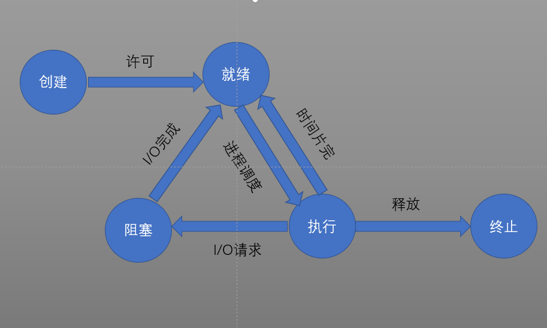
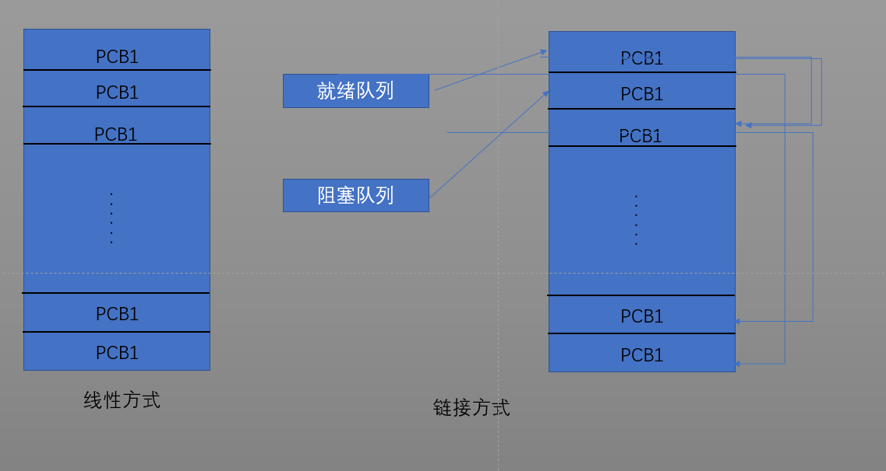

## 操作系统


#### **一、概述**

​	操作系统（Operating System，OS)是配置在计算机硬件上的第一层软件，是对硬件系统的首次扩充，主要作用是管理好这些硬件设备，提高它们的利用率和系统的吞吐量。而其他的诸如编译程序、数据库管理系统等系统软件、以及大量的应用软件都直接依赖于操作系统的支持。


#### **二、作用**

* 操作系统作为用户与计算机硬件系统之间的接口
* 操作系统作为计算机系统资源的管理者
* 操作系统实现了对计算机资源的抽象


#### **三、基本特性**

> 并发（Concurrence)

​	`并发` ：并发性是指两个或多个事件在同一时间间隔内发生

​	`并行` ：并行性是指两个或多个事件在同一时刻发生

<u>即对于单核CPU来说，线程的执行是并发的（线程由CPU调度轮流执行），对于多核CPU来说，线程时可以并行执行的</u> 

> 共享（Sharing）

​	操作系统环境下的资源共享是指系统中的资源可供内存中的多个并发执行的进程共同使用。

* 互斥共享方式

  在一段时间内只允许一个进程访问某个资源（打印机），这个资源称为临界资源

* 同时访问方式

  允许多个进程同时访问资源（磁盘）

>虚拟(Virtual)

* 时分复用

  * 虚拟CPU技术：CPU快速切换执行程序
  * 虚拟设备技术：将一台物理设备虚拟成多台逻辑上的设备

* 空分复用

  ​	空分复用技术是利用存储器的空闲空间分区存放和运行其他多道程序来提高内存的利用率，并不能实现在逻辑上扩大存储器容量的功能，须引入虚拟存储技术才能达到此目的。

> 异步（Asynchronism)

​	进程以人民不可预知的速度向前推进，为进程的异步性

`并发和共享是多任务操作系统的两个最基本的特征，它们又是互为存在的条件` 


#### 四、进程

> 进程控制块（Process Control Block PCB）

​	操作系统为程序配置专门的数据结构，称为进程控制块，用来描述进程的基本情况和活动过程，进而控制和管理进程。

> 进程的组成

​	进程由程序段、相关的数据段和进程控制块三部分组成

> 进程的定义

* 进程是程序的一次执行
* 进程是具有独立功能的程序在一个数据集合上运行的过程，它是系统进行资源分配和调度的一个独立单位

> 进程的特征

* 动态性

  ​动态性是进程最基本的特征，进程由一定的生命周期

* 并发性

  进程能同时存在内存中，且能在一段时间内同时运行，程序不能并发执行（因为会导致结果不可再现性）

* 独立性

  独立性是指进程能独立执行、独立获得资源和独立接受调度

* 异步性

  异步性指进程能按异步方式运行，各自独立、交替执行

> 进程的状态

* 创建
* 就绪
* 执行
* 阻塞
* 终止



 

> 进程管理

​	在计算机中，对于每个资源和每个进程都设置了一个数据结构，用于表征其实体，被称为资源信息表和进程信息表，这些表中包含了资源或进程的标识、描述、状态等信息。

​	操作系统管理的数据结构一般分为以下四类：内存表、设备表、文件表、进程表（进程控制块）

> 进程控制块的作用

* 作为独立运行基本单位的标志：当系统创建一个新进程时，就为其建立一个进程控制块，进程结束时就回收其进程控制块，进程控制块是进程存在于系统的唯一标志
* 实现间断性运行方式：系统可将CPU现场信息保存在被中断进程的进程控制块中，当该进程再次被调度执行时恢复CPU现场，保证了运行结果的可再现性
* 提供进程管理所需要的信息：通过进程控制块中保存的信息找到进程运行的资源和数据
* 提供进程调度所需要的信息：进程控制块中保存了进程的状态、优先级等调度信息
* 实现与其他进程的同步与通信：每个进程中都设置有相应的用于同步的信号量以及实现进程通信的区域或通信队列指针

> 进程控制块中的信息

* 进程标识符
* 处理机状态
* 进程调度信息
* 进程控制信息

> 进程控制块的组织方式

​	在系统中，通常拥有许多的进程，进程又有不同的状态（就绪、阻塞）等，为了有效的管理它们，应采用适当的组织方式

* 线性方式：每次查找都要扫描整张表
* 链接方式：将相同状态的进程链接成一个队列（可按优先级排序）
* 索引方式：根据进程状态的不同，建立几张索引表，索引表的指针进程控制块的地址

  ​ 

> 进程控制

​	进程控制是进程管理中最基本的功能，主要包括进程的创建、终止、负责进程的状态转换。进程控制一般由操作系统内核中的原语来实现

> 操作系统内核

​	现代操作系统一般将操作系统划分为若干层次，将那些与硬件紧密相关的模块（中断处理程序）、驱动程序、进程调度程序等运行频率高的软件常驻内存，这些模块构成操作系统的内核

> CPU执行状态

* 系统态：内核态，具有较高权限，能执行一切指令，访问所有寄存器和存储区
* 用户态：具有较低权限，仅能执行规定的指令，访问指定的寄存器和存储区


> 操作系统内核功能

1. 支持功能
   * 中断处理
   * 时钟管理
   * 原语操作
2. 资源管理功能
   * 进程管理
   * 存储器管理
   * 设备管理

> 进程同步

​	进程同步主要是对多个相关进程在执行次序上进行协调，使并发执行的诸进程之间能按照一定的规则（时序）共享系统资源，并能很好地相互合作，从而使程序的执行具有可再现性。

> 进程同步机制

​	硬件同步机制、信号量机制、管程机制等

​	进程同步存在两种形式的制约关系：间接相互制约关系（共享某一资源）、直接相互制约关系（等待另一进程产生的数据）

> 临界资源

​	在某一时刻只有一个进程能够访问的资源

> 临界区

​	每个进程访问临界资源的那段代码称为临界区

> 同步机制应遵循的规则

* 空闲让进：临界资源处于空闲状态时，应允许一个申请临界资源的进程立即进入自己的临界区
* 忙则等待：当临界资源已某个进程访问时，其他进程必须等待，保证对临界资源的互斥访问
* 有限等待：保证进程在有限时间内能够进入自己的临界区，以避免“死等”状态
* 让权等待：当进程不能进入自己的临界区时，应立即释放CPU，以避免陷入“忙等”状态

> 硬件同步机制

​	利用硬件指令有效地实现进程互斥，但不能做到“让权等待”的原则

> 信号量机制

​	信号量（Semaphores）机制：整型信号量->记录型信号量->“信号量集”

* Dijkstra整型信号量定义为一个表示资源数目的整型量S，通过两个标椎的原子操作P,V来访问资源

  ```java
  wait(S){	//申请资源 ，原语P操作
    while(S<=0){
      //当资源数目小于等于零时，一直轮询等待资源（资源数目小于零的S值代表有进程申请资源的总量）未遵循“让权等待”原则，会导致进程处于“忙等”状态
    }
      S--;	//资源数目减一
  }

  signal(S){	//释放资源 ，原语V操作
    S++;	//S值代表剩余资源总量
  }
  ```

  wait(S)和signal(S)是两个原子操作，执行时是不可中断的

> 记录型信号量

​	除了一个表示资源数目的信号量外，增加了一个表示等待资源的进程链表数据结构

```c
typedef struct{
  int value;	//资源数目
  struct process_control_block *list;	//等待的进程链表
}semaphore;
wait(Semaphore *S){
  S->value--;
  if(S->value < 0){
    block(S->list);		//如果资源数目小于0，则将本次申请资源的进程加入阻塞进程链表中
  }
}
signal(semaphore *S){
  S->value++;
  if(S->value <= 0){
    wakeup(S->list);
  }
}
```

> AND型信号量

​	AND同步机制的基本思想是将进程在整个运行过程中需要的所有资源，一次性全部地分配给进程，待进程使用完后再一起释放，但只要还有一个资源未能分配给进程，则其他资源都不可分配给该进程

```java
Swait(S1,S2,...,Sn){	//同时申请多个资源
  while(true){
    if(S1>=1 && ... && Sn>=1{
      for(i=1;i<=n;i++) {
        Si--;
      }
      //进程运行...
     
    })else{
      //将进程加入阻塞队列
    }
  }
}
Ssignal(S1,S2,...,Sn){	释放资源
  while(true){
    for(i=1;i<=n;i++){
      Si++;
    }
  }
}

```

> 信号量集

​	记录型信号量机制中每次P,V操作仅能对信号量进行加1或减一操作，即对某类临界资源进行一个单位的申请和释放。当进程需要多个资源时便要执行多次P，V操作，非常低效。

​	对AND信号量机制进行扩充，对进程所申请的所有资源及每个资源的数量在一个操作中完成申请或释放

> 信号量的应用

* 利用信号量实现进程互斥

  为使进程能互斥地访问临界资源，可在各进程访问该资源的临界区前后设置信号量的P,V操作。

  ```java
  mutex = 1	 //信号量初始化为1，1：可进入临界区，0：有进程在访问临界资源，不可进入临界区
    			//-1：阻塞队列有一个进程需要被唤醒
  进程A(){
    while(1){
      wait(mutex){
        临界区；
      }
      signal(mutex){
        剩余区；
      }
    }
  }
  进程B(){
    while(1){
      wait(mutex){
        临界区；
      }
      signal(mutex){
        剩余区；
      }
    }
  }
  ```

* 利用信号量实现前驱关系

  即可实现进程的执行按照人们的意愿有序执行，可通过在P1进程执行完后将进程P2的信号量设置为true，使进程P2能够进入自己的临界区，以此类推

  ```java
  进程A(){
    wait(A){
      //临界区
    }
    signal(B);
  }
  进程B(){
    wait(B){
      //临界区
      }
    signal(C);
  }
  进程C(){
    wait(C){
      //临界区
    }
    signal(A);
  }
  ```

> 管程（Monitors）

* 管程的定义：一个管程定义了一个数据结构和能为并发进程对数据结构进行的一组操作，这组操作能同步进程和改变管程中的数据。

  对系统中的各种软硬件资源抽象成为数据结构来表征其资源特性，并提供对该数据结构的一组操作，即对资源进行抽象的数据结构+在数据结构上的一组操作可以简单地认为是管程，并发进程对共享资源的操作即为对管程的操作，每次进入管程的进程只能有一个。在管程内部进行P,V操作可以避免像信号量那样对每个进程都进行P,V操作。

* 管程的特性：模块化，抽象数据类型，信息隐蔽

> 管程与进程的区别

1. 两者都定义了数据结构，但进程定义的是私有数据结构PCB，管程定义的是共享数据结构
2. 都存在对各自数据结构的操作，进程为由顺序程序执行的操作，管程是为同步操作
3. 进程实现系统并发功能，管程实现资源共享互斥的同步功能
4. 进程调用管程进行对资源的操作，管程复制进程间的同步问题
5. 进程能并发执行，管程是静态的模块化资源，供进程调用

> 进程通信

​	进程通信指进程间的信息交换。

​	进程通信机制可归纳为四大类：共享存储器系统，管道通信系统，消息传递系统，客户机-服务器系统

* 共享存储器系统

  * 基于共享数据结构的通信方式：这种通信方式仅适用于传递少量的数据，效率低下，属于低级通信
  * 基于共享存储区的通信方式：在内存中划出一块共享存储区域，诸进程可以通过对该共享区的读或写交换信息来实现通信，进程可将共享存储区内的数据拷贝一份到自己的地址空间中进行写操作，完成操作后再将数据写回共享存储区中。

* 管道（pipe）通信系统

  ​	管道是指用于连接一个读进程和一个写进程以实现它们之间通信的一个**共享文件** ，又称*管道文件* 。

  管道通信中的数据以字符流的形式进行传输来实现读/写进程间的通信。

  ​	管道机制必须满足：互斥，同步，确认对方是否存在

> 消息传递系统

​	该机制以格式化的消息为单位，将通信的数据封装在消息中完成进程间的通信

* 直接通信方式
* 间接通常方式

> 客户机-服务器系统

​	主要的实现方式有三类：套接字、远程过程调用、远程方法调用

* 套接字：一个套接字就是一个通信标识类型的数据结构(http://192.168.1.111:80，ftp://...)
* 远程过程调用：远程过程调用（RPC）是一个通信协议
* 远程方法调用：面向对象编程中可把远程过程调用视为远程方法调用

> RPC(Remote Procedure Call)

​	负责过程调用的进程两个，一个本地客户进程，另一个是远程服务器进程，这两个进程为网络守护进程，主要负责网络间的消息传递。

> 线程（Threads)

​	在操作系统中引入进程的目的是为了使多个程序能并发执行，提高资源利用率和系统吞吐量，而在操作系统中再引入线程，则是为了减少资源在并发执行时所付出的时空开销。

* 进程并发的时空开销

  *  创建进程：系统创建一个进程时，必须为它分配其必需的所有（CPU除外）资源（内存空间，IO设备），和建立对应的PCB
  *  撤销进程：对进程所占有的资源回收，销毁PCB
  *  **进程切换** ：对进程进行上下文切换时，需要保留当前进程的CPU环境，设置新进程的CPU环境，耗费时间

* 线程和进程的比较

  * 调度：进程调度需要进行进程上下文切换，开销大。线程调度仅需保存和设置少量寄存器内容。

    <u>从一个进程中的线程切换到另一个进程中的进程，必然就会引起进程的切换</u>

  * 资源：进程是系统分配资源的基本单位，线程本身并不拥有系统资源，仅能保存其独立运行的资源，如线程控制块TCB，同一进程中的线程可以共享资源，因为同一进程中的线程都具有相同的地址空间

* 线程的实现

  * 实现内核级线程的系统，CPU调度以线程为单位，实现用户级线程的系统，CPU的调度是以进程为单位进行的
  * 内核级线程KST
    * 内核级线程的创建、阻塞、撤销和销毁都是在内核空间实现的
    * 缺点：在同一个进程中，从一个线程切换到另一个线程时，需要从用户态转换到核心态进行，系统开销大
    * 每一个用户线程对应一个内核线程，CPU通过线程调度
  * 用户级线程ULT
    * 用户级线程的创建、阻塞、撤销和销毁都是在用户空间实现的
    * 由于实现用户级线程的系统的调度以进程为单位，因此在同一个进程中的不同线程的切换能够在用户空间实现，而不必切换到内核空间中
    * 一个内核线程对应一个用户进程，即对应进程中的一个或多个线程
    * 缺点：一个线程的阻塞会导致整个进程的阻塞
  * 组合式线程
    * 即将内核级线程和用户级线程组合起来


